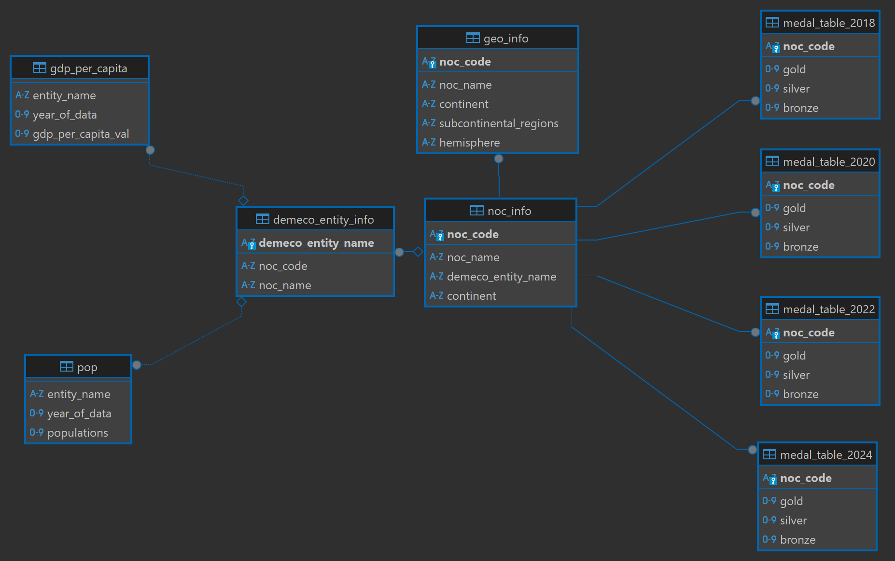

# Economics, Demographics, and Sporting Prowess
### A SQL (PostgreSQL) Data Analytic Project

A SQL data analytic project exploring the relationships between sporting strength and various economic and demographic metrics of countries and territories from across the world.

Using PostgreSQL, I will be answering questions like:
* Who has the highest GDP per capita but failed to win any medals at the Olympics?
* Who has the higehst number of medals per million residents?
* Which continent won the highest number of medals?
* And many more!

## Table of Contents

[Quick Navigation](#quick-navigation)\
[Project Description](#project-description)\
[Repo Structure](#repo-structure)\
[PostgreSQL Database Diagram](#postgresql-database-diagram)\
[Sources](#sources)\
[License](#license)\
[Disclaimers](#disclaimers)

## Quick Navigation

* [Results folder (including SQL query scripts)](sql_queries_and_outputs/) and the [Results folder README.md](sql_queries_and_outputs/README.md)
* [PostgreSQL schema script](schema.sql)

## Project Description

This project explores the relationships between sporting strength and various economic and demographic metrics of countries and territories from across the world.

The following economic and demographic metrics were analyzed in this project:
* Economic metrics: GDP per capita
* Demographic metrics: Population size

The medal performances at recent Olympic Games (OG) were chosen to represent sporting strength as the OG is the most prestigious and recognizable sporting event that encompasses over 30 sports and over 200 delegations from across the world. 

The raw data were processed with pandas in Python. Input datasets in CSV format were imported into a **PostgreSQL** database for query.

**Key SQL concepts applied in this project:** nested queries, CTE, subqueries, window functions, joins, views, aggregation functions, filtering, conditionals

## Repo Structure

* `database_csvs/`: input datasets
    * `*.csv`: input datasets, including medal counts and demographic and economic datasets
    * `input_data_descriptions.md`: detailed descriptions of the input datasets 
* `schema.sql`: the SQL script for creating the PostgreSQL database schema used in this project
* `sql_queries_and_outputs/`: SQL queries and their outputs
    * `s*_*_and_medals.sql`: SQL query scripts
        * `s1_exploratory_analyses.sq`: SQL queries for the exploratory analyses, such as the top performing delegations and continents at recent OGs
        * `s2_econ_and_medals.sql`: SQL queries for GDP per capita-related analysis
        * `s3_population_and_medals.sql`: SQL queries for population size-related analysis
    * `s*_*_and_medals.md`: The SQL queries and their associated outputs presented in a markdown format. The contents of these files are same as the identically named `s*_*_and_medals.sql` files but are presented in a markdown format for ease of visualization and navigation.
    * `README.md`: a navigation guide for this folder
* `LICENSE.txt`: License agreement
* `misc/`: Miscellaneous items, including disclaimer statements.

## PostgreSQL Database Diagram

For detailed descriptions of these tables, please check out these two files: [input_data_descriptions.md](database_csvs/input_data_descriptions.md) and [schema.sql](schema.sql).

## Sources

For detailed descriptions of the origins of the input data and sources consulted, please see [input_data_descriptions.md](database_csvs/input_data_descriptions.md).

## License

This repository is distributed under a Creative Commons Attribution Share Alike 4.0 International (CC-BY-SA-4.0) [license](LICENSE.txt).

## Disclaimers

This repository represents a personal SQL data analytic project. The information presented here are for informational purpose only and are provided on an as-is basis without any warranties. This repo is not intended to represent the personal opinions of the author and should not be construed as such in any way. **Please carefully review the full [disclaimer statements](misc/disclaimers.md).**

Thank you for checking out this project! I hope you enjoy these analyses, and best of luck to your favorite athletes on their quest for their next medal, whichever teams you support!
